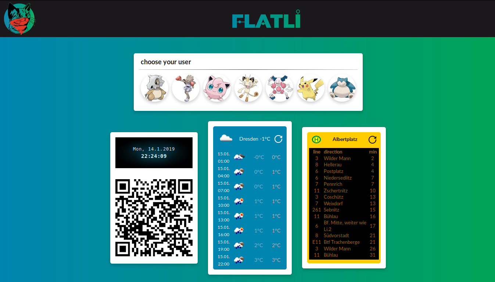
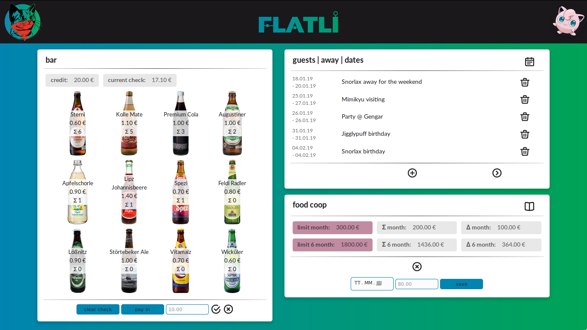
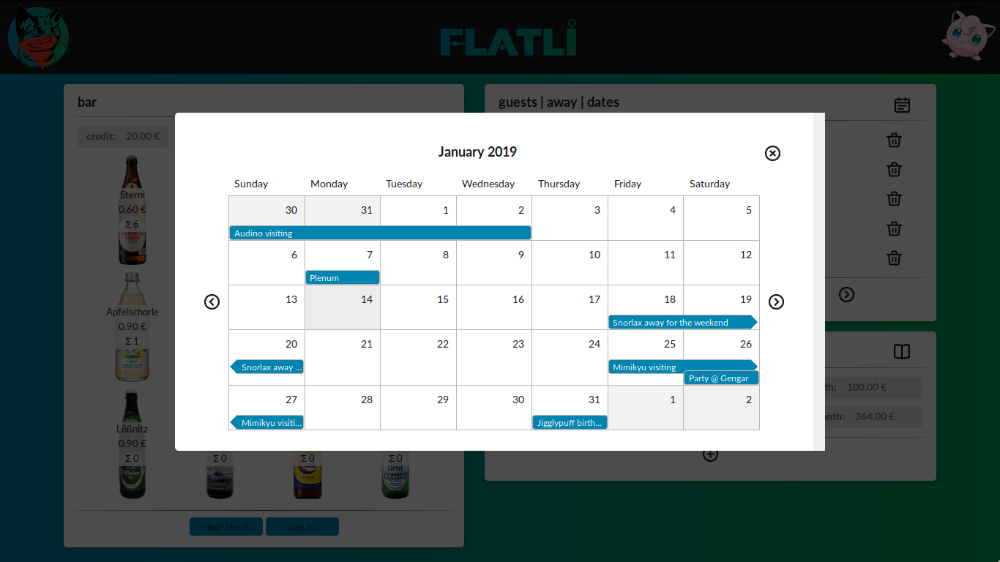
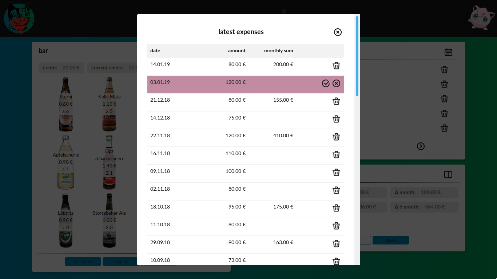

# Flatli

React single-page application for people living together in a flat share.

## Features

-   Welcome page

    -   Clock widget.
    -   QR code for checking into the guest WiFi.
    -   Current weather (in predefined city), populated with data from OpenWeatherMap API.
    -   Current departures of public transport from predefined stop, populated with data from DVB (Dresden public transport company) API.
    -   Possibility to pick one user to log in.

-   Main application page
    -   Bar component
        -   Overview on current check (amount of money user needs to pay for drinks) and current credit (amount user already put into the register).
        -   Checking in user's drinks, which will cause the respective count, sum and total check to increase.
        -   Checking in money user put into the register ("pay in").
        -   Settle credit and check with each other ("clear check").
        -   Drinks are sorted by count, so that user's favorite drinks are easily accessible on top.
    -   Date component
        -   List view of the next five upcoming dates with arrows to get next and/or previous batch.
        -   Add and delete dates.
        -   Calendar view in modal.
    -   Food coop component
        -   List of all expenses with monthly dates in modal, add and delete single expenses.
        -   Overview on total expenses in current month and in the last 6 month.
        -   Remainder until account reaches the limit for the current month or the last six months.
    -   Random cat gif generator hidden in the header using Giphy API.

## Technologies

HTML, CSS, JavaScript, React, Node.js, Express, PostgreSQL

## Development

-   Edit PostgreSQL database parameters in [db.js](config/db.js).
-   Run files in [sql](sql) to initialize tables in database.
-   As long as there is no admin interface, populate `users` and `drinks` table directly in the datebase.
-   Set `process.env.COOKIE_SECRET` or edit cookie secret parameter directly in [index.js](index.js).
-   Get keys for OpenWeatherMap and Giphy API, set them and all other API config in [index.js](index.js).

```sh
npm install
node bundle-server.js
node index.js
```

## Preview

### welcome page



### main page



### calendar modal



### expenses modal


